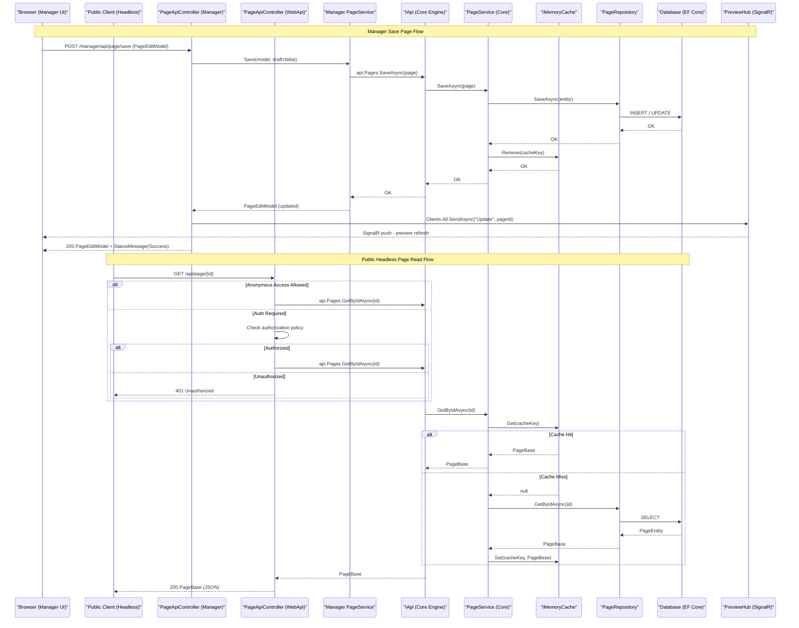

# API & Service Communication Contracts

Piranha CMS exposes approximately 60+ REST API endpoints across two distinct API surfaces: the **Manager API** (admin panel operations under `/manager/api/`) and the **Public Web API** (headless content delivery under `/api/`). All communication is synchronous HTTP/JSON with no message broker or inter-service async patterns, as this is a single-process library framework.

## Service Catalog

| Service | Port | Category | Purpose |
|---------|------|----------|---------|
| Piranha.Manager | 443/80 (host) | API Layer | Admin panel REST API — CRUD for pages, posts, media, sites, aliases, config |
| Piranha.WebApi | 443/80 (host) | API Layer | Headless public REST API for pages, posts, media, and sitemap |
| Piranha.AspNetCore | 443/80 (host) | Business | ASP.NET Core middleware — routing, security, sitemap serving |
| Piranha (Core) | — | Business | Central content engine: IApi facade, services, repositories |
| Piranha.Data.EF.* | — | Infrastructure | Entity Framework Core data providers (SQLite/SQL Server/PostgreSQL/MySQL) |
| Piranha.AspNetCore.Identity.* | — | Infrastructure | ASP.NET Core Identity authentication per database provider |
| PreviewHub (SignalR) | 443/80 (host) | Infrastructure | Real-time live-preview push notifications to Manager UI |

## API Endpoints Inventory

### Manager API (`/manager/api/` — requires Admin policy)

| Controller | Method | Path | Request Type | Response Type |
|-----------|--------|------|-------------|--------------|
| PageApiController | GET | /manager/api/page/list | — | PageListModel |
| PageApiController | GET | /manager/api/page/sitemap/{siteId?} | siteId (path, opt.) | SiteListModel |
| PageApiController | GET | /manager/api/page/archives/{siteId?} | siteId (path, opt.) | SiteListModel |
| PageApiController | GET | /manager/api/page/{id} | id (Guid, path) | PageEditModel |
| PageApiController | GET | /manager/api/page/info/{id} | id (Guid, path) | PageInfo |
| PageApiController | GET | /manager/api/page/create/{siteId}/{typeId} | siteId, typeId (path) | PageEditModel |
| PageApiController | GET | /manager/api/page/createrelative/{pageId}/{typeId}/{after} | path params | PageEditModel |
| PageApiController | GET | /manager/api/page/copy/{sourceId}/{siteId} | path params | PageEditModel |
| PageApiController | GET | /manager/api/page/copyrelative/{sourceId}/{pageId}/{after} | path params | PageEditModel |
| PageApiController | POST | /manager/api/page/detach | Guid (body) | PageEditModel |
| PageApiController | POST | /manager/api/page/save | PageEditModel (body) | PageEditModel |
| PageApiController | POST | /manager/api/page/save/draft | PageEditModel (body) | PageEditModel |
| PageApiController | POST | /manager/api/page/save/unpublish | PageEditModel (body) | PageEditModel |
| PageApiController | POST | /manager/api/page/revert | Guid (body) | PageEditModel |
| PageApiController | POST | /manager/api/page/move | StructureModel (body) | PageListModel |
| PageApiController | DELETE | /manager/api/page/delete | Guid (body) | StatusMessage |
| PostApiController | GET | /manager/api/post/list/{id}/{index?} | archiveId (path) | PostListModel |
| PostApiController | GET | /manager/api/post/{id} | id (Guid, path) | PostEditModel |
| PostApiController | GET | /manager/api/post/info/{id} | id (Guid, path) | PostInfo |
| PostApiController | GET | /manager/api/post/create/{archiveId}/{typeId} | path params | PostEditModel |
| PostApiController | GET | /manager/api/post/modal | siteId, archiveId (query) | PostModalModel |
| PostApiController | POST | /manager/api/post/save | PostEditModel (body) | PostEditModel |
| PostApiController | POST | /manager/api/post/save/draft | PostEditModel (body) | PostEditModel |
| PostApiController | POST | /manager/api/post/save/unpublish | PostEditModel (body) | PostEditModel |
| PostApiController | POST | /manager/api/post/revert | Guid (body) | PostEditModel |
| PostApiController | DELETE | /manager/api/post/delete | Guid (body) | StatusMessage |
| MediaApiController | GET | /manager/api/media/{id} | id (Guid, path) | MediaItem / 404 |
| MediaApiController | GET | /manager/api/media/url/{id}/{width?}/{height?} | path params | Redirect / 404 |
| MediaApiController | GET | /manager/api/media/list/{folderId?} | folderId (path), filter, width, height (query) | MediaListModel |
| MediaApiController | POST | /manager/api/media/meta/save | MediaListModel.MediaItem (body) | StatusMessage |
| MediaApiController | POST | /manager/api/media/folder/save | MediaFolderModel (body) | MediaListModel |
| MediaApiController | POST | /manager/api/media/upload | MediaUploadModel (form) | StatusMessage |
| MediaApiController | POST | /manager/api/media/move/{folderId?} | IEnumerable&lt;Guid&gt; (body) | StatusMessage |
| MediaApiController | DELETE | /manager/api/media/folder/delete | Guid (body) | MediaListModel |
| MediaApiController | DELETE | /manager/api/media/delete | IEnumerable&lt;Guid&gt; (body) | StatusMessage |
| SiteApiController | GET | /manager/api/site/{id} | id (Guid, path) | SiteEditModel |
| SiteApiController | GET | /manager/api/site/content/{id} | id (Guid, path) | SiteContentEditModel / 404 |
| SiteApiController | GET | /manager/api/site/create | — | SiteEditModel |
| SiteApiController | POST | /manager/api/site/save | SiteEditModel (body) | StatusMessage |
| SiteApiController | POST | /manager/api/site/savecontent | SiteContentEditModel (body) | StatusMessage |
| SiteApiController | DELETE | /manager/api/site/delete | Guid (body) | StatusMessage |
| AliasApiController | GET | /manager/api/alias/list/{siteId?} | siteId (path, opt.) | AliasListModel |
| AliasApiController | POST | /manager/api/alias/save | AliasListModel.AliasItem (body) | AliasListModel |
| AliasApiController | DELETE | /manager/api/alias/delete | Guid (body) | AliasListModel |
| ConfigApiController | GET | /manager/api/config | — | ConfigModel |
| ConfigApiController | POST | /manager/api/config/save | ConfigModel (body) | StatusMessage |
| ContentApiController | GET | /manager/api/content/{id} | id (Guid, path) | ContentEditModel |
| ContentApiController | POST | /manager/api/content/save | ContentEditModel (body) | ContentEditModel |
| ContentApiController | DELETE | /manager/api/content/delete | Guid (body) | StatusMessage |
| LanguageApiController | GET | /manager/api/language/list | — | LanguageListModel |
| LanguageApiController | POST | /manager/api/language/save | LanguageItem (body) | StatusMessage |
| LanguageApiController | DELETE | /manager/api/language/delete | Guid (body) | StatusMessage |
| PermissionApiController | GET | /manager/api/permission | — | PermissionListModel |
| ModuleApiController | GET | /manager/api/module | — | ModuleListModel |
| CommentApiController | GET | /manager/api/comment/list/{id} | id (path) | CommentListModel |
| CommentApiController | POST | /manager/api/comment/approve | Guid (body) | StatusMessage |
| CommentApiController | DELETE | /manager/api/comment/delete | Guid (body) | StatusMessage |

### Public Web API (`/api/` — optional auth via AllowAnonymousAccess flag)

| Controller | Method | Path | Request Type | Response Type |
|-----------|--------|------|-------------|--------------|
| PageApiController (WebApi) | GET | /api/page/{id} | id (Guid, path) | PageBase / 401 |
| PageApiController (WebApi) | GET | /api/page/slug/{slug} | slug (path) | PageBase / 401 |
| PostApiController (WebApi) | GET | /api/post/{id} | id (Guid, path) | PostBase / 401 |
| PostApiController (WebApi) | GET | /api/post/slug/{slug} | slug (path) | PostBase / 401 |
| MediaApiController (WebApi) | GET | /api/media/{id} | id (Guid, path) | Media / 401 |
| SitemapApiController (WebApi) | GET | /api/sitemap | siteId (query, opt.) | Sitemap XML / JSON |

## Management & Observability Endpoints

| Service | Endpoint | Notes |
|---------|----------|-------|
| Piranha.AspNetCore | /sitemap.xml | XML sitemap served by SitemapMiddleware |
| Piranha.Manager | /manager | Manager SPA shell (ManagerController) |
| Piranha.Manager | /manager/api/* | All Manager REST endpoints |
| All (host app) | /health | No built-in health check endpoint; host application must register one via ASP.NET Core Health Checks |

> Note: No Swagger/OpenAPI, Prometheus metrics endpoint, or built-in `/health` probe is included in the Piranha framework. These must be configured at the host application level.

## DTOs & Contracts

All DTOs are **service-level models** owned by Piranha.Manager or Piranha.WebApi — there is no API gateway tier aggregating data from separate services.

**Manager API DTOs (Piranha.Manager.Models namespace):**
- `PageEditModel` — request/response for page create/save/get operations; includes regions, blocks, and status
- `PageListModel` — response for page list and sitemap views
- `PostEditModel` — request/response for post create/save/get operations
- `PostListModel` — response for paginated post archives
- `MediaListModel` — response for media browser; embeds `MediaItem` sub-model
- `MediaListModel.MediaItem` — request/response for media metadata
- `MediaFolderModel` — request/response for folder management
- `MediaUploadModel` — multipart form request for file uploads
- `SiteEditModel` — request/response for site management
- `SiteContentEditModel` — request/response for site-level content
- `SiteListModel` — response for site-scoped page listings
- `AliasListModel` — response for URL alias list; embeds `AliasItem`
- `AliasListModel.AliasItem` — request/response for alias save
- `ConfigModel` — request/response for CMS configuration settings
- `ContentEditModel` — request/response for structured generic content
- `StructureModel` — request body for page reorder/move operations
- `PostModalModel` — response for post picker dialog
- `StatusMessage` — universal response envelope for mutation results; carries `Type` (Success/Error/Warning/Information) and `Body` string

**Public Web API types (Piranha.Models namespace):**
- `PageBase` / `GenericPage` — response model for public page delivery; fields listed in `data-architecture.md`
- `PostBase` / `GenericPost` — response model for public post delivery
- `PageInfo` / `PostInfo` — lightweight info models (id, slug, title, published date)

**Serialization:** The Manager API uses `Newtonsoft.Json` via `AddNewtonsoftJson()`. The public Web API uses the default ASP.NET Core JSON serializer. No OpenAPI/Swagger specification, no protobuf `.proto` files, and no GraphQL schema are present in the repository.

## Communication Patterns

**Synchronous only:** All inter-component communication is in-process method calls and direct HTTP REST within a single ASP.NET Core process. There are no message queues, event buses, or async messaging infrastructure.

**No service discovery:** All components are compiled into a single host process. There is no Eureka, Consul, or Kubernetes DNS service discovery.

**No API gateway:** The Manager and Public Web API are both hosted directly in the same ASP.NET Core application. There is no gateway tier, BFF, or proxy.

**SignalR (real-time push):** The `PreviewHub` uses SignalR for one-directional push from server to Manager UI clients. When a page or post is saved, the API controllers call `hub.Clients.All.SendAsync("Update", id)` to trigger a live preview refresh in open browser windows.

**Resilience:** No Polly circuit-breaker, retry, or timeout policies are configured. The framework relies on EF Core's built-in connection resiliency (via `EnableRetryOnFailure` available to consumers) and does not enforce timeout SLAs at the service layer.

**Security posture:** The Manager API enforces authentication via the `[Authorize(Policy = Permission.Admin)]` attribute at the controller class level, with granular per-action policies (e.g., `Permission.PagesPublish`, `Permission.MediaAdd`). ASP.NET Core's policy-based authorization backed by `IAuthorizationService` is used throughout. The public `Piranha.WebApi` supports an `AllowAnonymousAccess` flag — when `false`, an authorization check against `Permissions.Pages` is enforced on every public endpoint. No JWT or OAuth2 client credentials flow is built-in; identity is managed through ASP.NET Core Identity (cookie-based by default). HTTPS/TLS is not enforced at the framework level and must be configured by the host application. Anti-forgery token validation (`[AutoValidateAntiforgeryToken]`) is applied to all Manager API controllers.

## Service Technology Matrix

| Service | Web Framework | Data Access | Discovery | Gateway | Health Check | Cache | Metrics |
|---------|--------------|-------------|-----------|---------|-------------|-------|---------|
| Piranha.Manager | ASP.NET Core MVC + SignalR | Via IApi/EF Core | None | None | None (host) | IMemoryCache | None |
| Piranha.WebApi | ASP.NET Core MVC | Via IApi/EF Core | None | None | None (host) | IMemoryCache | None |
| Piranha.AspNetCore | ASP.NET Core Middleware | Via IApi | None | None | None (host) | IMemoryCache | None |
| Piranha (Core) | None | EF Core (pluggable) | None | None | None | IMemoryCache | None |
| Piranha.Data.EF.* | None | EFCore + AutoMapper | None | None | None | None | None |
| Piranha.AspNetCore.Identity.* | ASP.NET Core Identity | EFCore Identity | None | None | None | None | None |

## Service Communication Sequence

