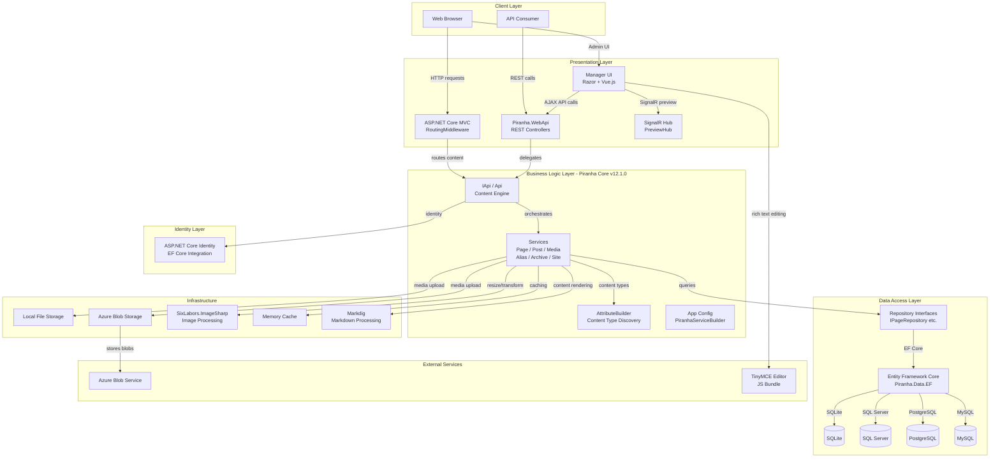
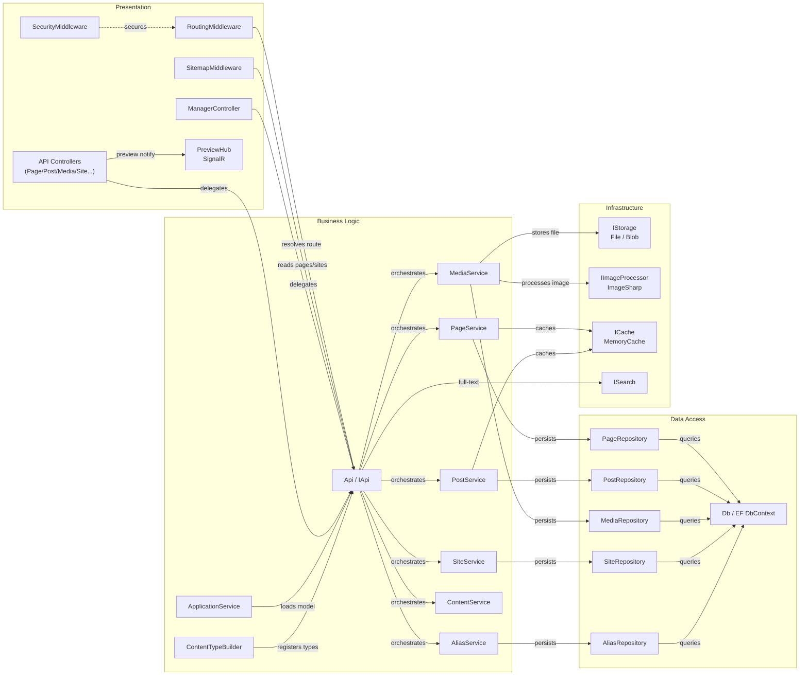

# Architecture Diagram

Piranha CMS is a modular, headless-capable .NET CMS framework (v12.1.0) built on ASP.NET Core. It provides a clean separation between the core content engine, data-access providers, and pluggable front-end hosting layers.

## Application Architecture

### Technology Stack Summary

| Layer | Technology | Version | Purpose |
|-------|-----------|---------|---------|
| Presentation | ASP.NET Core MVC | net8.0 / net9.0 | Server-side routing and page rendering |
| Presentation | Piranha.Manager (Razor + Vue.js) | 12.1.0 | Admin/manager UI with SPA components |
| Presentation | Piranha.WebApi | 12.1.0 | REST API for headless consumption |
| Presentation | SignalR | ASP.NET Core built-in | Live preview hub |
| Business Logic | Piranha Core (IApi) | 12.1.0 | Content management engine |
| Business Logic | Markdig | 0.40.0 | Markdown-to-HTML rendering |
| Business Logic | Newtonsoft.Json | 13.0.3 | JSON serialization |
| Business Logic | AttributeBuilder | 12.1.0 | Attribute-driven content type registration |
| Data Access | Entity Framework Core | 8.0.0 / 9.0.0 | ORM for relational data persistence |
| Data Access | AutoMapper | 12.0.1 | Entity-to-model mapping |
| Data Access | SQLite / SQL Server / PostgreSQL / MySQL | — | Pluggable relational database backends |
| Identity | ASP.NET Core Identity + EF Core | 8.0.0 / 9.0.0 | Authentication and user management |
| Storage | Local FileStorage | 12.1.0 | Local disk media storage |
| Storage | Azure Blob Storage SDK | 12.18.0 | Cloud media storage |
| Image Processing | SixLabors.ImageSharp | 2.1.13 | Server-side image resizing and transformation |
| Caching | Microsoft.Extensions.Caching | 8.0.0 / 9.0.0 | In-memory content cache |

### Data Storage & External Services

Piranha CMS uses Entity Framework Core as its primary data-access layer with four interchangeable relational database backends — SQLite (default for development), SQL Server, PostgreSQL, and MySQL. Each backend is a separate NuGet package (`Piranha.Data.EF.*`). Media assets are stored either on local disk via `Piranha.Local.FileStorage` or in Azure Blob Storage via `Piranha.Azure.BlobStorage`. Identity and user data are managed through ASP.NET Core Identity with corresponding EF Core database providers. The in-memory cache (`IMemoryCache`) reduces repeated database lookups for frequently accessed content objects.

### Key Architectural Decisions

- **Repository + Service pattern**: All content operations are exposed through strongly-typed service interfaces (`IPageService`, `IPostService`, etc.) backed by repository interfaces, enabling full substitution of the data layer without touching business logic.
- **Modular plug-in design**: Storage, image processing, database provider, and identity are all opt-in packages — a host application composes them via `AddPiranha` / `UsePiranha` extension methods, following the ASP.NET Core options pattern.
- **Multi-target framework**: All library packages target both `net8.0` and `net9.0`, allowing consumers to stay on either LTS or current releases.

## Component Relationships

### Component Inventory

| Component | Layer | Type | Responsibility |
|-----------|-------|------|---------------|
| RoutingMiddleware | Presentation | ASP.NET Middleware | Resolves incoming URLs to Piranha page/post routes |
| SecurityMiddleware | Presentation | ASP.NET Middleware | Enforces content-level security policies |
| SitemapMiddleware | Presentation | ASP.NET Middleware | Serves XML sitemap at `/sitemap.xml` |
| ManagerController | Presentation | MVC Controller | Renders the SPA shell for the Manager admin panel |
| PageApiController | Presentation | API Controller | REST endpoints for page CRUD via Manager |
| PostApiController | Presentation | API Controller | REST endpoints for post CRUD via Manager |
| MediaApiController | Presentation | API Controller | REST endpoints for media management |
| SiteApiController | Presentation | API Controller | REST endpoints for site management |
| AliasApiController | Presentation | API Controller | REST endpoints for URL alias management |
| ContentApiController | Presentation | API Controller | REST endpoints for generic content blocks |
| ConfigApiController | Presentation | API Controller | REST endpoints for CMS configuration |
| PreviewHub | Presentation | SignalR Hub | Pushes live preview refresh events to Manager UI |
| IApi / Api | Business Logic | Facade Service | Central entry point exposing all CMS services |
| PageService | Business Logic | Domain Service | Page lifecycle management (create, publish, delete) |
| PostService | Business Logic | Domain Service | Post/blog lifecycle management |
| MediaService | Business Logic | Domain Service | Media asset upload, resize, and deletion |
| AliasService | Business Logic | Domain Service | URL alias resolution and management |
| SiteService | Business Logic | Domain Service | Multi-site configuration management |
| ContentService | Business Logic | Domain Service | Generic structured-content management |
| ApplicationService | Business Logic | Request Service | Per-request application state (current site, language) |
| ContentTypeBuilder | Business Logic | Utility | Scans assemblies for content type attributes and registers them |
| Db / EF DbContext | Data Access | EF Core DbContext | Wraps all entity sets; applies migrations |
| PageRepository | Data Access | Repository | EF-based persistence for page entities |
| PostRepository | Data Access | Repository | EF-based persistence for post entities |
| MediaRepository | Data Access | Repository | EF-based persistence for media metadata |
| SiteRepository | Data Access | Repository | EF-based persistence for site entities |
| AliasRepository | Data Access | Repository | EF-based persistence for URL aliases |
| IStorage / LocalStorage | Infrastructure | Storage Provider | Abstracts file I/O (local disk or Azure Blob) |
| IImageProcessor / ImageSharp | Infrastructure | Image Processor | Server-side image transformation using ImageSharp |
| ICache / MemoryCache | Infrastructure | Cache | In-process caching of frequently read content |
| ISearch | Infrastructure | Search Provider | Pluggable full-text search abstraction |
