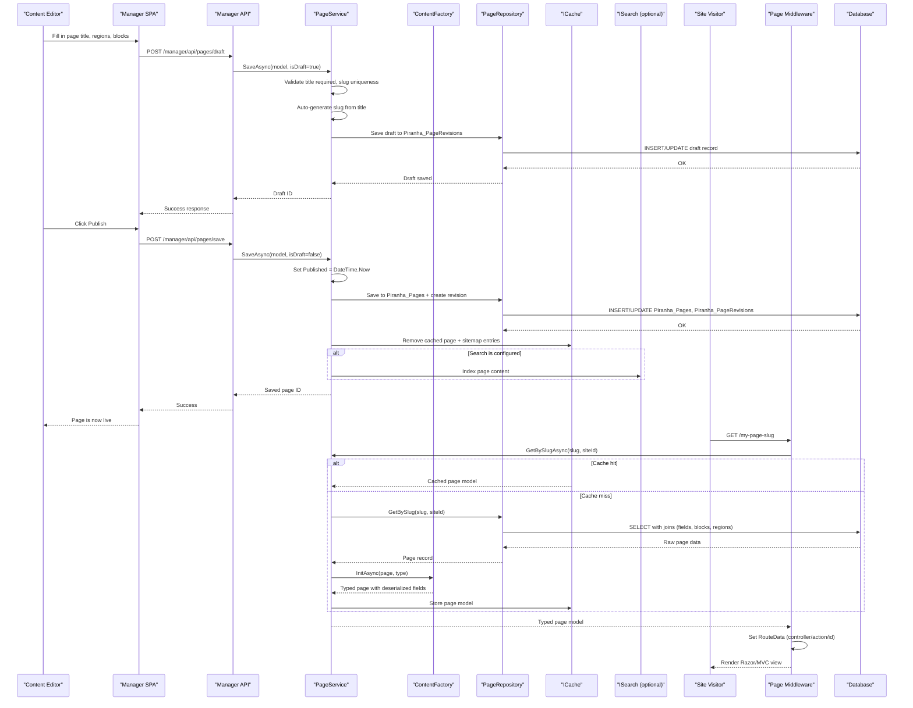

# Core Business Workflows

Piranha CMS is a headless-capable content management framework that enables editors to create, manage, and publish structured web content (pages, posts, media, and site settings) through a Manager back-office, while delivering that content to visitors via routed MVC/Razor views or a public REST API.

## Domain Entities

| Entity | Service / Bounded Context | Description | Key Relationships |
|--------|--------------------------|-------------|------------------|
| Site | Site Management | Top-level tenant; one or more sites can run from a single instance | Owns SiteContent, Pages, Posts |
| SiteContent | Site Management | Typed structured content fields attached to the site itself | Belongs to Site |
| Page | Content Management | Hierarchical web page with typed regions, blocks, and comments | Belongs to Site; has parent Page; has Comments; linked to PageType |
| Post | Content Management | Blog/news entry under a blog (archive) page, with tags and categories | Belongs to Blog Page; has Comments; linked to PostType |
| Content | Content Management | Standalone typed content items (not routed) | Belongs to ContentGroup; linked to ContentType |
| PageType | Schema Management | Registered template definition for Page structure (regions, blocks) | Used by Pages |
| PostType | Schema Management | Registered template definition for Post structure | Used by Posts |
| ContentType | Schema Management | Registered template definition for standalone Content items | Used by Content |
| SiteType | Schema Management | Registered template definition for SiteContent fields | Used by SiteContent |
| Media | Media Management | Uploaded binary files (images, documents, audio, video) with optional scaled versions | Belongs to MediaFolder; referenced by fields |
| MediaFolder | Media Management | Hierarchical folder for organizing Media | Contains Media and child MediaFolders |
| Comment (Page/Post) | Comment Management | Visitor-submitted comment, optionally requiring approval | Belongs to Page or Post |
| Alias | Routing Management | URL redirect rule mapping an old URL to a new URL | Belongs to Site |
| Taxonomy (Category/Tag) | Content Classification | Hierarchical category or flat tag applied to Posts | Applied to PostBase |
| Param | Configuration Management | Named key/value pairs stored in the database for runtime CMS configuration | Global (no site scoping) |
| Language | Localization | Registered language/culture for multilingual content | Referenced by Site for default language |

## Service-to-Domain Mapping

| Service / Layer | Domain Context | Owned Entities | External Dependencies |
|----------------|----------------|---------------|----------------------|
| `PageService` | Content Management | Page, PageComment, PageRevision | IPageRepository, IContentFactory, ISiteService, IMediaService, ICache, ISearch |
| `PostService` | Content Management | Post, PostComment, PostRevision | IPostRepository, IContentFactory, ISiteService, IPageService, IMediaService, ICache, ISearch |
| `ContentService` | Content Management | Content | IContentRepository, IContentFactory, IMediaService, ICache |
| `SiteService` | Site Management | Site, SiteContent | ISiteRepository, IContentFactory, ICache |
| `MediaService` | Media Management | Media, MediaFolder, MediaVersion | IMediaRepository, IStorage, IImageProcessor, ICache |
| `AliasService` | Routing Management | Alias | IAliasRepository, ICache |
| `ParamService` | Configuration Management | Param | IParamRepository, ICache |
| `LanguageService` | Localization | Language | ILanguageRepository, ICache |
| `ArchiveService` | Content Delivery | PostArchive (read model) | IArchiveRepository, IPostService, IPageService |
| `ContentTypeService` / `PageTypeService` / `PostTypeService` | Schema Management | ContentType, PageType, PostType, SiteType | Type repositories; ICache |
| Manager API (`/manager/api/*`) | Editorial Back-Office | All entities (read/write) | All services via `IApi` |
| Public Web API (`/api/*`) | Headless Delivery | Pages, Posts, Sitemap (read-only) | IPageService, IPostService, ISiteService |
| ASP.NET Core Routing Middleware | Request Routing | Site, Page, Post, Alias | ISiteService, IPageService, IPostService, IAliasService |

All services communicate synchronously within a single process via the `IApi` façade. There are no message queues or inter-service HTTP calls.

## Primary Workflows

### Workflow 1: Content Creation and Publishing (Page/Post Lifecycle)

The most central workflow in Piranha CMS is the editorial cycle for pages and posts.

**Steps:**
1. **Create draft** — Editor opens Manager and creates a new page or post. `PageService.CreateAsync<T>()` initializes the model with default comment settings from `Piranha_Params` (CommentsEnabledForPages/Posts, CommentsCloseAfterDays). No slug is generated yet.
2. **Compose content** — Editor fills in title, regions, and block content (HtmlBlock, MarkdownBlock, ImageBlock, etc.) through the Manager Vue.js SPA. Content is auto-saved as a draft via `POST /manager/api/pages/draft` or `POST /manager/api/posts/draft`.
3. **Save draft** — `PageService.SaveAsync(model, isDraft: true)` validates the model (Title required, Slug uniqueness within the site), auto-generates the slug from the title if not set, resolves hierarchical slug (if `HierarchicalPageSlugs=true`, prefixes parent slug), persists draft to `Piranha_PageRevisions` table, does NOT update `Piranha_Pages.Published`.
4. **Preview** — Editor can preview the draft. Manager serves the page with the draft content via `GET /manager/api/pages/preview/{id}`.
5. **Publish** — Editor clicks Publish. `PageService.SaveAsync(model, isDraft: false)` sets `Published = DateTime.Now` (or the scheduled date), persists the canonical record to `Piranha_Pages`, writes the current state as a numbered revision in `Piranha_PageRevisions`, invalidates the in-memory cache for this page's Id and the site's sitemap, and (if `ISearch` is registered) indexes the page in the configured search engine.
6. **Routing serves published content** — On the next visitor request, the `PageMiddleware` matches the URL slug, calls `PageService.GetBySlugAsync<T>()`, populates the cache, and forwards to the registered Razor/MVC view.
7. **Unpublish** — Editor saves with `Published = null`. Cache is invalidated; the page is no longer served by the routing middleware (returns 404) but remains in the database.
8. **Delete** — `PageService.DeleteAsync(id)` removes the page and all its revisions, comments, and block data. The storage service does NOT automatically delete referenced media files. Cache is invalidated.

**Revision management:** Revisions are created on every save (draft and publish). When `PageRevisions` Param is set to a nonzero value, older revisions beyond the limit are pruned during the save.

---

### Workflow 2: Media Upload and Processing

**Steps:**
1. **Upload initiated** — Editor drags and drops a file onto the Manager Media browser. Manager calls `POST /manager/api/media/upload`.
2. **Validate** — `MediaService.SaveAsync(model)` validates that filename and size are provided.
3. **Store binary** — Calls `IStorage.OpenWriteAsync()` to write the file bytes to the configured storage backend (local disk or Azure Blob Storage).
4. **Process image** — If `IImageProcessor` is registered (SixLabors.ImageSharp) and the file is an image type, `ProcessImageAsync()` generates scaled thumbnail and responsive variants, storing each variant via `IStorage` and recording them in `Piranha_MediaVersions`.
5. **Persist metadata** — Media record (filename, content type, MIME type, size, CDN URL if configured) is saved to `Piranha_Media`.
6. **Cache invalidation** — The in-memory `MediaStructure` cached list is removed from `ICache` so the next browse request reflects the new file.
7. **Reference in content** — Editors use the ImageField or MediaField pickers in the Manager to link the Media item's `Guid` ID into page/post content. During content serialization, field serializers resolve the ID to a URL using the CDN base URL from the `MediaCdnUrl` Param.

---

### Workflow 3: URL Alias / Redirect Management

**Steps:**
1. **Editor creates alias** — Via Manager at `POST /manager/api/aliases`. Alias has an `AliasUrl` (source) and `RedirectUrl` (target) and a `RedirectType` (301 Permanent or 302 Temporary).
2. **Persist** — `AliasService.SaveAsync(alias)` ensures both `AliasUrl` and `RedirectUrl` are non-empty, normalizes the source URL (prepends `/` if missing), and persists to `Piranha_Aliases`. Cache entry for the alias set is removed.
3. **Routing** — On an incoming request, `AliasMiddleware` (enabled when `RoutingOptions.UseAliasRouting = true`) queries `AliasService.GetByAliasUrlAsync()`. If a match is found, the middleware issues an HTTP redirect with the configured redirect type.

---

### Workflow 4: Comment Submission and Moderation

**Steps:**
1. **Visitor submits comment** — A visitor posts to a page/post comment endpoint. `PageService.SaveCommentAsync(pageId, comment)` or `PostService.SaveCommentAsync(postId, comment)` is called.
2. **Validate** — Checks that the parent content item exists. Validates that commenting is enabled (`EnableComments = true`) and that the comment window has not expired (`CloseCommentsAfterDays` not exceeded since `Published` date). Also validates that `Author` and `Body` are provided.
3. **Auto-approve check** — If the `CommentsApprove` Param is `true`, the comment is saved with `IsApproved = true` and immediately visible to readers. If `false`, saved with `IsApproved = false` and placed in a moderation queue.
4. **Moderation** — In the Manager, editors access pending comments via `GET /manager/api/pages/comments/pending` or `GET /manager/api/posts/comments/pending`. Approving a comment calls `PageService.ApproveCommentAsync(commentId)`, which flips `IsApproved = true`.
5. **Delete** — Editors can delete any comment via `PageService.DeleteCommentAsync(commentId)`.

---

### Workflow 5: Application Startup and Content Type Registration

**Steps:**
1. **`builder.AddPiranha(options)`** — Registers all Piranha services into the ASP.NET Core DI container. Options include the storage provider (local/Azure Blob), image processor (ImageSharp), and database backend (SQLite/SQL Server/PostgreSQL/MySQL).
2. **`app.UsePiranha(options)`** — Configures the middleware pipeline and calls `App.Init(api)` to load all PageTypes, PostTypes, ContentTypes, SiteTypes, Params, and Languages from the database.
3. **`ContentTypeBuilder.Build(assembly)`** (optional) — Scans the host assembly for classes annotated with `[PageType]`, `[PostType]`, `[ContentType]`, `[SiteType]` and calls the corresponding `SaveAsync` on the type services to register or update content type definitions in the database.
4. **EF Core migration** — On first DbContext access, `Database.Migrate()` runs pending migrations to create or update the schema. This is guarded by a static `SemaphoreSlim` mutex to be safe in concurrent startup scenarios.
5. **Seed** — After migration, `Seed()` inserts the default Language (`en-US`) and required Param records if they do not already exist.

## Cross-Service Data Flows

Piranha CMS is a **single-process** monolith. All cross-domain data flows occur in-process through the `IApi` façade rather than over a network.

**Typical content delivery composition:**
- `SiteService.GetDefaultAsync()` resolves the default site (or matches hostname for multi-site) → returns `Site` with default language and ContentType ID
- `PageService.GetBySlugAsync<T>(slug, siteId)` checks `ICache` first; on miss, calls `IPageRepository.GetBySlug()` → joins `Piranha_Pages`, `Piranha_PageFields`, `Piranha_PageBlocks`, `Piranha_PageBlockFields`, `Piranha_PageRegions`; deserializes field values via `IContentFactory` → caches result → returns typed page model

**Media field resolution in content:**
- When `PageService` or `PostService` loads a model via `ContentFactory.InitAsync()`, any `ImageField`/`MediaField` values (stored as `Guid` JSON in `Piranha_PageFields`) are resolved by `MediaFieldSerializer` → calls `MediaService.GetByIdAsync(mediaId)` → returns full `Media` record → field holds the URL built from `PublicUrl` + optional `MediaCdnUrl` prefix

**Archive data aggregation:**
- `ArchiveService.GetPageAsync<T>(blogId, currentPage, pageSize, ...)` queries posts via `IArchiveRepository`, then enriches each with blog page info via `IPageService.GetByIdAsync<PageInfo>()` — the blog page's `Title` and `Slug` are injected into each `PostBase.BlogSlug`

**No circuit breaker or fallback patterns** are present because all calls are in-process. If the database is unavailable, the request fails rather than degrading gracefully.

## Business Workflow Sequence

The following diagram shows the primary end-to-end workflow: a content editor publishes a page, and a visitor subsequently reads it.

## Business Rules & Decision Logic

### Validation Rules

| Rule | Entity | Details |
|------|--------|---------|
| Title required | Page, Post, Content | `[Required]` DataAnnotation; service throws `ValidationException` on save |
| Slug uniqueness | Page | Slug must be unique within a Site; service checks existing slug before save |
| Slug auto-generation | Page, Post | If Slug is empty on save, generated from Title via `Utils.GenerateSlug()` (lowercase, hyphenated) |
| Hierarchical slug | Page | If `HierarchicalPageSlugs = true`, child page slug is prefixed with parent page slug |
| Comment window | Page, Post | Comments rejected if `CloseCommentsAfterDays > 0` and `DateTime.Now > Published + CloseCommentsAfterDays` |
| Comment fields | Comment | Author and Body are required |
| Page copy constraint | Page | `DetachAsync()` throws `ValidationException("Page is not a copy")` if `OriginalPageId` is not set |
| Alias URL normalization | Alias | Source `AliasUrl` is normalized to start with `/` |
| Media filename required | Media | `ValidationException` thrown if filename is null/empty on save |

### State Transitions

**Page / Post lifecycle states:**

| State | Condition |
|-------|-----------|
| Draft | `Published == null` and only saved to `Piranha_PageRevisions` |
| Scheduled | `Published != null` and `Published > DateTime.Now` |
| Published | `Published != null` and `Published <= DateTime.Now` |
| Unpublished | `Published` reset to `null` after having been published |

**Comment moderation states:**

| State | Condition |
|-------|-----------|
| Pending | `IsApproved == false` |
| Approved | `IsApproved == true` |
| Deleted | Record removed from `Piranha_PostComments` / `Piranha_PageComments` |

### Decision Logic

- **Draft vs. Publish branch**: The `isDraft` boolean parameter passed to `SaveAsync` controls whether the record is written to `Piranha_Pages` (published) or only to `Piranha_PageRevisions` (draft). The Manager calls the draft endpoint on auto-save and the publish endpoint on explicit user action.
- **Cache level gating**: `PageService`, `PostService`, and `MediaService` only activate the `ICache` dependency if `App.CacheLevel > 2` (enum: None=0, Minimal=1, Full=3). This prevents unintended caching in multi-instance deployments without a distributed cache.
- **Image processing conditional**: `MediaService.ProcessImageAsync()` is only invoked if both `IImageProcessor != null` (ImageSharp registered) and the file's MIME type is an image type. Non-image uploads skip scaling entirely.
- **Multi-site hostname routing**: `SiteService` checks the request `Host` header against the `Hostnames` field on each Site record. If no match, the default site (marked `IsDefault = true`) is used as fallback.
- **Alias routing priority**: `AliasMiddleware` runs before `PageMiddleware` and `PostMiddleware`. If an alias matches the request URL, a redirect is issued and no further content resolution occurs.
- **HierarchicalPageSlugs**: When this Param is `true`, `PageService.SaveAsync()` reads the parent page's slug and prepends it (recursively up the tree) to the child slug. When `false`, each page's slug is relative to the site root regardless of hierarchy.
- **Revision pruning**: If `PageRevisions` or `PostRevisions` Param is set to a positive integer N, the save operation deletes the oldest revisions beyond N. If set to 0 (default), all revision history is retained indefinitely.

### Cross-Cutting Concerns

| Concern | Implementation |
|---------|---------------|
| Authorization (Manager) | `[Authorize(Policy = Permission.Admin)]` on all Manager API controllers; granular per-action policies (e.g., `Permission.PagesPublish`) checked via ASP.NET Core authorization middleware |
| XSRF Protection | Manager SPA sends `X-XSRF-TOKEN` header; API validates against cookie `XSRF-REQUEST-TOKEN` (configured via `ManagerOptions`) |
| Transactions | EF Core DbContext tracks changes and saves in a single `SaveChangesAsync()` call per repository operation; no distributed transaction support |
| Cache invalidation | Services call `_cache.RemoveAsync(cacheKey)` for the affected entity and any derived cache keys (sitemap, structure) immediately after a successful save or delete |
| Hook system | `App.Hooks` provides `OnValidate`, `OnBeforeSave`, `OnAfterSave`, `OnBeforeDelete`, `OnAfterDelete` hooks for Page, Post, and Media — allowing host applications to inject custom business logic at extension points |
| Search indexing | After a successful publish or delete, services call `ISearch.SavePageAsync()` / `ISearch.DeletePageAsync()` (or post equivalents) if an `ISearch` implementation is registered |
| Audit / change tracking | All entities store `Created` and `LastModified` timestamps; revisions in `Piranha_PageRevisions` / `Piranha_PostRevisions` provide a full change history |
