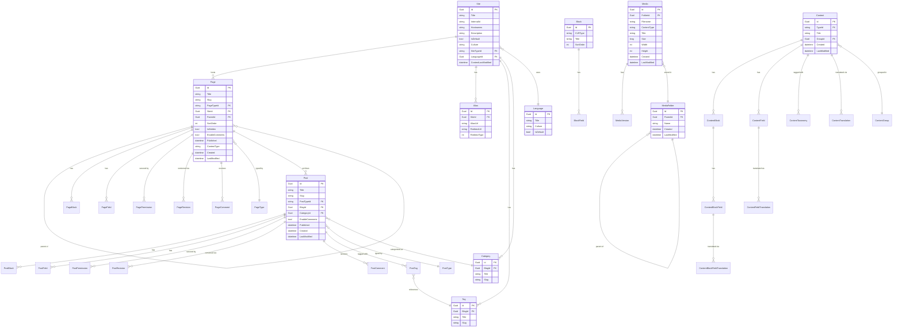

# Data Architecture & Persistence Layer

Piranha CMS uses Entity Framework Core as its single ORM layer, with 35+ mapped entities persisted to one of four interchangeable relational databases (SQLite, SQL Server, PostgreSQL, MySQL), all managed by a shared abstract `Db<T>` DbContext in `Piranha.Data.EF`.

## Database Configuration

| Service/Module | DB Type | Profile/Environment | Driver Package | Migration Tool | Notes |
|---------------|---------|-------------------|---------------|---------------|-------|
| Piranha.Data.EF.SQLite | SQLite | Development (default example) | Microsoft.EntityFrameworkCore.Sqlite | EF Core Migrations (auto) | Schema created/migrated in DbContext constructor via `Database.Migrate()` |
| Piranha.Data.EF.SQLServer | SQL Server | Production / SQL Server | Microsoft.EntityFrameworkCore.SqlServer | EF Core Migrations (auto) | Same migration base; provider-specific migrations in each package |
| Piranha.Data.EF.PostgreSql | PostgreSQL | Production / PostgreSQL | Npgsql.EntityFrameworkCore.PostgreSQL | EF Core Migrations (auto) | Npgsql provider handles timestamp/uuid type mapping |
| Piranha.Data.EF.MySql | MySQL / MariaDB | Production / MySQL | Pomelo.EntityFrameworkCore.MySql | EF Core Migrations (auto) | Pomelo provider; requires server version specification |
| Piranha.AspNetCore.Identity.SQLite | SQLite (Identity) | Development | Microsoft.AspNetCore.Identity.EntityFrameworkCore | EF Core Migrations (auto) | Separate DbContext for ASP.NET Core Identity tables |
| Piranha.AspNetCore.Identity.SQLServer | SQL Server (Identity) | Production / SQL Server | Microsoft.AspNetCore.Identity.EntityFrameworkCore | EF Core Migrations (auto) | |
| Piranha.AspNetCore.Identity.PostgreSQL | PostgreSQL (Identity) | Production / PostgreSQL | Microsoft.AspNetCore.Identity.EntityFrameworkCore | EF Core Migrations (auto) | |
| Piranha.AspNetCore.Identity.MySQL | MySQL (Identity) | Production / MySQL | Microsoft.AspNetCore.Identity.EntityFrameworkCore | EF Core Migrations (auto) | |

All database providers use EF Core's `Database.Migrate()` called once on first DbContext construction (guarded by a static mutex). No Flyway, Liquibase, or separate migration runner is used. Seed data is applied in a virtual `Seed()` method on the DbContext after migrations run. For connection string configuration details see `configuration-inventory.md`.

## Data Ownership per Service

| Service | Tables Owned | ORM Framework | Caching | Notes |
|---------|-------------|--------------|---------|-------|
| Piranha.Data.EF | Piranha_Aliases, Piranha_Blocks, Piranha_BlockFields, Piranha_Categories, Piranha_Content, Piranha_ContentBlocks, Piranha_ContentBlockFields, Piranha_ContentBlockFieldTranslations, Piranha_ContentFields, Piranha_ContentFieldTranslations, Piranha_ContentGroups, Piranha_ContentTaxonomies, Piranha_ContentTranslations, Piranha_ContentTypes, Piranha_Languages, Piranha_Media, Piranha_MediaFolders, Piranha_MediaVersions, Piranha_Pages, Piranha_PageBlocks, Piranha_PageComments, Piranha_PageFields, Piranha_PagePermissions, Piranha_PageRevisions, Piranha_PageTypes, Piranha_Params, Piranha_Posts, Piranha_PostBlocks, Piranha_PostComments, Piranha_PostFields, Piranha_PostPermissions, Piranha_PostRevisions, Piranha_PostTags, Piranha_PostTypes, Piranha_Sites, Piranha_SiteFields, Piranha_SiteTypes, Piranha_Tags, Piranha_Taxonomies | EF Core (AutoMapper for entity-to-model mapping) | IMemoryCache (via core services) | Single shared DbContext (`Db<T>`) for all CMS tables |
| Piranha.AspNetCore.Identity.* | AspNetUsers, AspNetRoles, AspNetUserRoles, AspNetUserClaims, AspNetRoleClaims, AspNetUserLogins, AspNetUserTokens | EF Core (ASP.NET Core Identity) | None | Separate DbContext; standard ASP.NET Core Identity schema |

## Entity Model

## Key Repository Methods

| Service | Repository | Notable Methods | Purpose |
|---------|-----------|----------------|---------|
| Piranha.Data.EF | PageRepository | `GetAll(siteId)` | Returns all page IDs for a site, ordered by parent/sort |
| Piranha.Data.EF | PageRepository | `GetAllBlogs(siteId)` | Returns IDs of blog archive pages only |
| Piranha.Data.EF | PageRepository | `GetById<T>(id)` | Loads full page with blocks, fields, permissions, type via eager loading |
| Piranha.Data.EF | PageRepository | `GetBySlug<T>(slug, siteId)` | Resolves page by URL slug within a site |
| Piranha.Data.EF | PageRepository | `GetDraft<T>(id)` | Returns the current unpublished draft for a page |
| Piranha.Data.EF | PageRepository | `Move(page, parentId, sortOrder)` | Reorders page in the sitemap hierarchy |
| Piranha.Data.EF | PostRepository | `GetAll(blogId, categoryId, tagId, page, pageSize)` | Paginated post list for an archive, filtered by category/tag |
| Piranha.Data.EF | PostRepository | `GetById<T>(id)` | Loads full post with blocks, fields, tags, category via eager loading |
| Piranha.Data.EF | PostRepository | `GetBySlug<T>(slug, blogId)` | Resolves post by URL slug within a blog |
| Piranha.Data.EF | PostRepository | `GetDraft<T>(id)` | Returns the current unpublished draft for a post |
| Piranha.Data.EF | MediaRepository | `GetAll(folderId)` | Returns all media items in a folder |
| Piranha.Data.EF | MediaRepository | `GetById(id)` | Loads media with versions |
| Piranha.Data.EF | MediaRepository | `Move(media, folderId)` | Moves media to a different folder |
| Piranha.Data.EF | AliasRepository | `GetAll(siteId)` | All URL aliases for a site |
| Piranha.Data.EF | AliasRepository | `GetByAliasUrl(url, siteId)` | Resolves redirect alias by incoming URL |
| Piranha.Data.EF | SiteRepository | `GetDefault()` | Returns the default site (IsDefault=true) |
| Piranha.Data.EF | SiteRepository | `GetByHostname(hostname)` | Resolves site by request hostname |
| Piranha.Data.EF | ArchiveRepository | `GetPage(archiveId, currentPage, categoryId, tagId, year, month, take)` | Paginated post archive query with optional date/taxonomy filters |

All repository implementations use `AsNoTracking()` for read operations and explicit `SaveChangesAsync()` for writes. No raw SQL stored procedures or `FromSqlRaw` calls were detected.

## Caching Strategy

| Layer | Provider | Pattern | Scope | Rationale |
|-------|---------|---------|-------|-----------|
| ICache (Core) | `IMemoryCache` (in-process) | Cache-aside | Per-entity by Guid key | Frequently read content objects (pages, posts, sites) are cached after first DB load and evicted on save/delete |
| Sitemap cache | `IMemoryCache` | Cache-aside | Per-site sitemap structure | Full sitemap tree is cached to avoid recursive page queries on every request |
| Content type cache | In-memory static collections | Write-once / read-many | Application lifetime | Registered page/post/site types are stored in static `App.*List` collections; never evicted |

**Pattern:** Cache-aside throughout — services check `ICache.Get<T>(key)`, load from repository on miss, then call `ICache.Set(key, value)`. On mutation (save/delete), the service calls `ICache.Remove(key)` for the affected entity and any related collection caches (e.g., sitemap).

**TTL:** No explicit TTL is configured for the default `IMemoryCache` implementation. Items persist until manual eviction or application restart. Consumers may substitute a distributed cache (e.g., Redis via `IDistributedCache`) by providing a custom `ICache` implementation.

**No second-level or query-result caching** is configured at the EF Core layer.

## Data Ownership Boundaries

All CMS data — pages, posts, media, aliases, sites, taxonomies — is owned by a **single shared database** accessed through the `Db<T>` DbContext. Identity data lives in a **logically separate** (but physically co-located) database context (`IdentityDbContext`) that uses its own connection string. In default example setups both contexts share the same SQLite file (`piranha.db`).

There is no database-per-service topology; this is a monolithic single-process application where all services access the same DbContext. Cross-service data access does not occur over the network — all repositories share the same `IDb` instance injected at startup. The gateway aggregation pattern (combining data from multiple services) is implemented in-process: `ArchiveRepository.GetPage()` performs a bulk paginated query joining posts, categories, and tags in a single EF Core query.

**Read/Write patterns:** All reads use `AsNoTracking()` projections. Writes are explicit (`SaveChangesAsync()`). There is no CQRS split, no read replica, and no event sourcing pattern.

### Data Classification & Sensitivity

| Entity | Sensitive Fields | Classification | Controls in Place |
|--------|----------------|---------------|-----------------|
| AspNetUsers (Identity) | UserName, Email, NormalizedEmail, PhoneNumber, PasswordHash | PII | ASP.NET Core Identity hashes passwords (PBKDF2); email stored in plaintext; no field-level encryption or masking configured |
| AspNetUsers (Identity) | ConcurrencyStamp, SecurityStamp | Internal token | Used for invalidating sessions; not PII but security-sensitive |
| Site | Hostnames, Culture | None (config data) | Not PII |
| Page / Post | Title, Slug, MetaTitle, MetaDescription, OgTitle, OgDescription | None (content data) | Not PII |
| Media | Filename, Title, AltText, Description | None (asset metadata) | Not PII |
| PageComment / PostComment | AuthorName, AuthorEmail, AuthorUrl | PII | Stored in plaintext; no encryption or masking configured |
| Alias | AliasUrl, RedirectUrl | None (routing data) | Not PII |
| Language | Title, Culture | None (config data) | Not PII |

**Summary:** PII is limited to user account data (managed by ASP.NET Core Identity) and comment author information. Passwords are hashed via PBKDF2 through Identity. Comment author emails and names are stored in plaintext with no field-level encryption or data masking configured. No PHI or PCI data types are present in the entity model.
