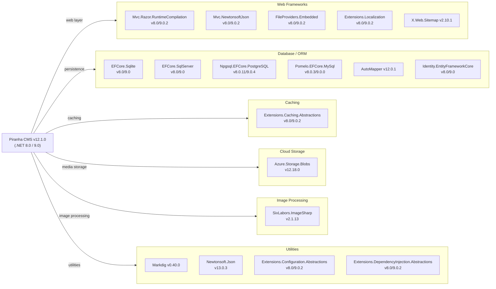

# Dependency Map

Piranha CMS (v12.1.0) is a .NET 8.0/9.0 framework comprising 26 projects. It declares **17 distinct external NuGet packages** across production code, spanning web framework extensions, ORM providers, cloud storage, image processing, and content-rendering utilities.

## Dependencies

### Dependency Summary

| Category | Count | Key Libraries | Notes |
|----------|-------|--------------|-------|
| Web Frameworks | 5 | Mvc.Razor.RuntimeCompilation, Mvc.NewtonsoftJson, Extensions.Localization, FileProviders.Embedded, X.Web.Sitemap | All ASP.NET Core aligned; dual versions for net8/net9 |
| Database / ORM | 6 | EFCore.Sqlite, EFCore.SqlServer, Npgsql EFCore, Pomelo EFCore MySql, AutoMapper, Identity.EFCore | Four pluggable DB backends; EFCore Design is build-time only |
| Caching | 1 | Extensions.Caching.Abstractions | Abstraction only; concrete provider (MemoryCache) is implicit via ASP.NET Core |
| Cloud Storage | 1 | Azure.Storage.Blobs 12.18.0 | Used by Piranha.Azure.BlobStorage module |
| Image Processing | 1 | SixLabors.ImageSharp 2.1.13 | Used by Piranha.ImageSharp for server-side resize/transform |
| Utilities | 4 | Markdig, Newtonsoft.Json, Configuration.Abstractions, DI.Abstractions | Core helpers for markdown, JSON, config, and DI |

### Version & Compatibility Risks

Most packages are current and aligned with the dual `net8.0`/`net9.0` target. The main risk area is **SixLabors.ImageSharp v2.1.13** — ImageSharp 3.x introduced breaking API changes and v2.x is receiving only security fixes; upgrading to v3 will require code changes in `Piranha.ImageSharp`. **Newtonsoft.Json 13.0.3** remains widely used but `System.Text.Json` (built into .NET 8+) is the recommended successor; the dependency exists partly because `Mvc.NewtonsoftJson` is explicitly referenced for JSON serialization in the Manager API. **AutoMapper 12.0.1** is stable but AutoMapper 13+ has significant DI registration API changes. **Pomelo.EntityFrameworkCore.MySql 9.0.0** and **Npgsql 9.0.4** are current for .NET 9, so no immediate risk there.

### Notable Observations

- **Dual-version package declarations**: All Microsoft.Extensions.* and EFCore packages are declared twice (once per `<TargetFramework>` condition). This avoids floating version conflicts but doubles the number of explicit version pins to maintain.
- **No distributed cache provider declared**: `Extensions.Caching.Abstractions` is referenced, but only `UseMemoryCache()` is used in examples. There is no Redis or SQL distributed cache package, limiting scalability for multi-instance deployments.
- **Azure Blob Storage is an opt-in module**: `Azure.Storage.Blobs` is only pulled in if the `Piranha.Azure.BlobStorage` project is referenced. Default deployments rely solely on local filesystem storage.
- **No observability/telemetry package**: There is no OpenTelemetry, Application Insights, or logging provider package referenced in any project file. Structured logging is expected to be configured entirely by the host application.

## Test Dependencies

| Framework | Version | Notes |
|-----------|---------|-------|
| xunit | 2.7.0 | Primary test framework for both test projects |
| xunit.runner.visualstudio | 2.5.7 | Visual Studio / CI test runner integration |
| Microsoft.NET.Test.Sdk | 17.9.0 | .NET test execution host |
| coverlet.collector | 6.0.2 | Code coverage data collection |
| coverlet.msbuild | 6.0.2 | MSBuild-integrated code coverage |

Total test-scope dependencies: **5**

Both test projects (`Piranha.Tests` and `Piranha.Manager.Tests`) use the same xUnit + coverlet stack. No mocking framework (e.g., Moq, NSubstitute) is declared, which suggests tests rely on real or stub implementations rather than mocked dependencies. No integration-test framework (e.g., Testcontainers, WebApplicationFactory fixtures) is declared at the package level — integration tests are likely driven by EF Core in-memory or SQLite.
