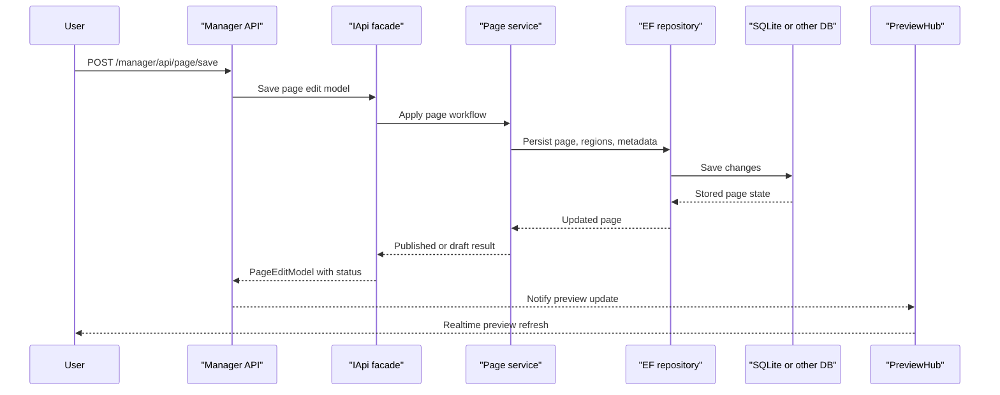

# API & Service Communication Contracts

Piranha.Core exposes a compact public REST surface for headless content delivery and a much broader manager API for authoring, publishing, media, and site administration. Communication is primarily synchronous in-process service calls behind ASP.NET Core controllers, with SignalR used for realtime preview updates.

## Service Catalog

| Service | Port | Category | Purpose |
|---|---|---|---|
| `MvcWeb` | 5000, 5001 | API Layer | Example ASP.NET Core MVC host that wires Piranha modules into a runnable CMS site |
| `RazorWeb` | 5000, 5001 | API Layer | Example ASP.NET Core Razor Pages host for the same CMS runtime |
| `Piranha.Manager` | In-process with host app | Business | Admin UI and management API for content, media, sites, comments, languages, modules, and config |
| `Piranha.WebApi` | In-process with host app | API Layer | Public read-oriented REST API for pages, posts, sitemap, and media |
| `Piranha` core services | In-process library | Business | `IApi` facade and internal services for content orchestration |
| Identity provider projects | In-process with host app | Infrastructure | Authentication and authorization integration backed by ASP.NET Core Identity |

## API Endpoints Inventory

| Service | Method | Path | Request Type | Response Type |
|---|---|---|---|---|
| `Piranha.WebApi` | GET | `/api/page/{id:Guid}` | Path parameter `id` | Page model |
| `Piranha.WebApi` | GET | `/api/page/{slug}` | Path parameter `slug` | Page model |
| `Piranha.WebApi` | GET | `/api/page/{siteId}/{slug}` | Path parameters `siteId`, `slug` | Page model |
| `Piranha.WebApi` | GET | `/api/page/info/{id:Guid}` and related slug routes | Path parameters | Page info model |
| `Piranha.WebApi` | GET | `/api/post/{id:Guid}` | Path parameter `id` | Post model |
| `Piranha.WebApi` | GET | `/api/post/{archiveId}/{slug}` | Path parameters | Post model |
| `Piranha.WebApi` | GET | `/api/sitemap/{id:Guid?}` | Optional path parameter | Sitemap model |
| `Piranha.WebApi` | GET | `/api/media/{id}` | Path parameter `id` | Media model |
| `Piranha.WebApi` | GET | `/api/media/url/{id}/{width?}/{height?}` | Path parameters | String URL |
| `Piranha.Manager` | GET | `/manager/api/page/*` | Path and query parameters | `PageEditModel`, list models, sitemap models |
| `Piranha.Manager` | POST | `/manager/api/page/save`, `/save/draft`, `/save/unpublish`, `/move`, `/detach`, `/revert` | `PageEditModel` or operation-specific payload | `PageEditModel` or async status |
| `Piranha.Manager` | DELETE | `/manager/api/page/delete` | Body or query identifiers | Async status |
| `Piranha.Manager` | GET | `/manager/api/post/*` | Path and query parameters | `PostEditModel`, `PostListModel`, `PostModalModel` |
| `Piranha.Manager` | POST | `/manager/api/post/save`, `/save/draft`, `/save/unpublish`, `/revert` | `PostEditModel` | `PostEditModel` or async status |
| `Piranha.Manager` | DELETE | `/manager/api/post/delete` | Identifier payload | Async status |
| `Piranha.Manager` | GET | `/manager/api/media/*` | Path and query parameters | `MediaListModel`, media items |
| `Piranha.Manager` | POST | `/manager/api/media/upload`, `/meta/save`, `/folder/save`, `/move/{folderId?}` | Multipart form or media DTOs | Async status |
| `Piranha.Manager` | DELETE | `/manager/api/media/delete`, `/folder/delete` | Identifier payload | Async status |
| `Piranha.Manager` | GET, POST, DELETE | `/manager/api/site/*`, `/comment/*`, `/alias/*`, `/language`, `/config/*`, `/content/blocktypes/*`, `/module/list`, `/permissions` | Various manager DTOs | Edit models, list models, async status |

## Management & Observability Endpoints

| Service | Endpoint | Custom Metrics |
|---|---|---|
| `Piranha.Manager` | `/manager/api/permissions` | None detected |
| `Piranha.Manager` | `/manager/login/auth/{returnUrl?}` | None detected |
| `Piranha.Manager` | `/manager/preview` SignalR hub | None detected |
| `MvcWeb` and `RazorWeb` | No dedicated `/health`, `/healthz`, or Swagger endpoint found in source | None detected |

## DTOs & Contracts

Manager API contracts are centered on mutable edit and list models such as `PageEditModel`, `PostEditModel`, `SiteEditModel`, `MediaListModel`, `CommentListModel`, `AliasListModel`, and `ConfigModel`. These DTOs are service-level contracts used by the admin UI, while public API controllers return core content models such as pages, posts, sitemap entries, and media records. The solution uses class-based DTOs and model objects rather than C# records, and JSON serialization is driven through ASP.NET Core plus `Microsoft.AspNetCore.Mvc.NewtonsoftJson`; for the full entity shape and persistence model, see `data-architecture.md`.

## Communication Patterns

The main communication pattern is synchronous HTTP into ASP.NET Core controllers followed by in-process service calls through the `IApi` facade and its internal services. The admin layer uses SignalR for asynchronous preview notifications after content save operations, but no message broker, gRPC, circuit breaker, retry library, service discovery layer, or API gateway product is declared in the solution. Security posture is stronger for manager routes than for the public API: manager controllers are protected with `Authorize` policies and antiforgery validation, while the public headless API is oriented around content retrieval and does not expose a separate TLS or token layer in source beyond what the ASP.NET Core host provides.

## Service Technology Matrix

| Service | Web | Data Access | Gateway | Actuator | Cache | Metrics |
|---|---|---|---|---|---|---|
| `MvcWeb` | ASP.NET Core MVC | EF Core via `UseEF<SQLiteDb>` | No | No | Memory cache | None detected |
| `RazorWeb` | ASP.NET Core Razor Pages | EF Core via `UseEF<SQLiteDb>` | No | No | Memory cache | None detected |
| `Piranha.Manager` | ASP.NET Core MVC and SignalR | Through `IApi` and repositories | No | No | Inherited from core runtime | None detected |
| `Piranha.WebApi` | ASP.NET Core API controllers | Through `IApi` and repositories | No | No | Inherited from core runtime | None detected |
| `Piranha` core | Service facade | EF Core repositories | No | No | Memory or distributed cache | None detected |

## Service Communication Sequence

