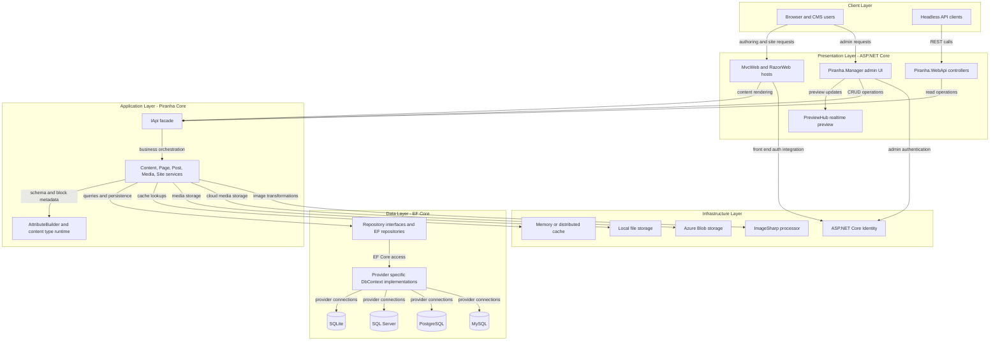
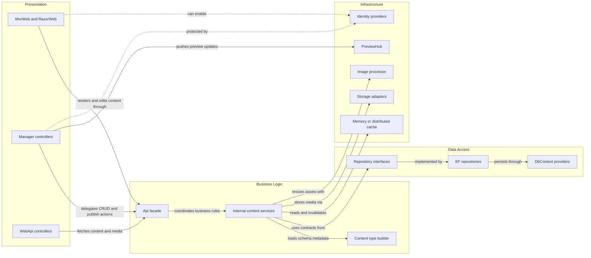

# Architecture Diagram

Piranha.Core is a modular .NET CMS composed of reusable class libraries, data-provider packages, identity integrations, and sample host applications. The solution separates presentation, application services, persistence, and infrastructure so the same core can be hosted with different UI, storage, and database combinations.

## Application Architecture

### Technology Stack Summary

| Layer | Technology | Version | Purpose |
|---|---|---:|---|
| Presentation | ASP.NET Core MVC and Razor | net8.0, net9.0 | Hosts example sites, admin UI, and API endpoints |
| Application | Piranha core services via `IApi` | 12.1.0 | Central facade for content, site, page, post, media, and taxonomy workflows |
| Data | Entity Framework Core providers | 8.0.x, 9.0.x | Database access through provider-specific packages |
| Identity | ASP.NET Core Identity | 8.0.x, 9.0.x | Manager and application authentication integration |
| Storage | Local filesystem and Azure Blob Storage | Azure.Storage.Blobs 12.18.0 | Media persistence backends |
| Media | SixLabors ImageSharp | 2.1.13 | Image resizing and transformation |

### Data Storage & External Services

The core runtime persists CMS data through Entity Framework Core with interchangeable SQLite, SQL Server, PostgreSQL, and MySQL providers. Media can be stored on the local filesystem or Azure Blob Storage, while the admin experience also uses SignalR for preview notifications and ASP.NET Core Identity for authenticated management flows.

### Key Architectural Decisions

- Uses a central `IApi` facade over internal services and repositories so host applications and the manager UI share the same content workflows.
- Keeps the persistence layer provider-agnostic by placing EF Core implementations and database providers in separate projects from the core domain libraries.
- Treats infrastructure concerns such as storage, caching, image processing, and identity as pluggable modules that can be enabled by startup extensions in the host application.

## Component Relationships

### Component Inventory

| Component | Layer | Type | Responsibility |
|---|---|---|---|
| `MvcWeb` and `RazorWeb` | Presentation | Host applications | Configure Piranha and serve example CMS sites |
| `Piranha.Manager` controllers | Presentation | MVC controllers | Handle admin editing, publishing, media, site, and config operations |
| `Piranha.WebApi` controllers | Presentation | API controllers | Expose headless read-oriented CMS endpoints |
| `Piranha.Api` | Business Logic | Facade service | Aggregates the core service surface behind `IApi` |
| Internal page, post, media, site services | Business Logic | Domain services | Apply CMS business rules and call repositories and infrastructure |
| `ContentTypeBuilder` and runtime type services | Business Logic | Metadata builder | Assemble and manage dynamic content schemas |
| Repository interfaces | Data Access | Abstractions | Define persistence contracts for aliases, pages, posts, media, sites, and taxonomies |
| EF repositories | Data Access | Repository implementations | Translate core persistence contracts to EF Core queries |
| Provider-specific `DbContext` classes | Data Access | DbContext | Connect EF Core to SQLite, SQL Server, PostgreSQL, and MySQL |
| `PreviewHub` | Infrastructure | SignalR hub | Notifies connected clients about live preview updates |
| `ICache` implementations | Infrastructure | Cache adapters | Provide memory and distributed caching options |
| `IStorage` implementations | Infrastructure | Storage adapters | Persist media to local files or Azure Blob Storage |
| `IImageProcessor` implementation | Infrastructure | Media processor | Generates transformed image versions |
| Identity provider projects | Infrastructure | Auth adapters | Integrate ASP.NET Core Identity with provider-specific stores |
