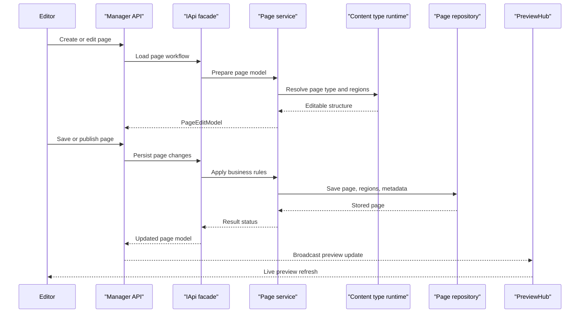

# Core Business Workflows

Piranha.Core is a CMS platform whose main business purpose is to let editors create, organize, publish, and manage website content across pages, posts, media, sites, and related metadata. The core workflows revolve around editorial content lifecycle management rather than domain-specific transactional processing.

## Domain Entities

| Entity | Service / Bounded Context | Description | Key Relationships |
|---|---|---|---|
| Site | Site Management | Represents a managed site within a CMS instance | Owns pages, posts, aliases, and site fields |
| Page | Page Management | Hierarchical content item for site navigation and publishing | Belongs to a site, has blocks, fields, revisions, permissions, and comments |
| Post | Post Management | Archive-oriented content item for blog or news publishing | Belongs to a site archive, has tags, categories, revisions, and comments |
| Content Type | Content Schema | Defines the editable structure for pages, posts, and shared content | Used by pages, posts, and site content builders |
| Media | Media Management | Represents uploaded assets and derived versions | Belongs to a folder and can have multiple resized versions |
| Alias | Routing | Maps alternate URLs and redirects | Scoped to a site |
| Comment | Moderation | Captures reader feedback on published content | Attached to pages or posts and subject to approval |
| Taxonomy | Classification | Supports categories and tags for posts and content discovery | Linked to posts through tag and category relationships |

## Service-to-Domain Mapping

| Service | Domain Context | Owned Entities | External Dependencies |
|---|---|---|---|
| `PageService` | Page authoring and publishing | Page, page revisions, page permissions, page comments | Repositories, cache, preview hub |
| `PostService` | Blog and archive publishing | Post, post revisions, post permissions, post comments, taxonomy links | Repositories, cache, preview hub |
| `MediaService` | Asset management | Media, media folders, media versions | Storage adapters, image processor, repositories |
| `SiteService` | Site administration | Site, site fields, default site metadata | Repositories, cache |
| `ContentTypeService` and builder runtime | Content schema management | Content types, block and field metadata | Repositories and runtime type registration |
| `AliasService`, `LanguageService`, `ParamService` | Routing, localization, configuration | Alias, language, parameter data | Repositories, cache |

## Primary Workflows

### Workflow 1: Create and publish a page

An editor opens the manager UI, creates a page from a content type, fills regions or blocks, and saves or publishes the page. The workflow validates editor permissions, loads the dynamic page schema, persists page metadata and content records, updates hierarchy information, and then emits a preview notification so the editor can see the change immediately.

### Workflow 2: Draft, publish, and revert a post

An editor creates a post under an archive, assigns taxonomy, and saves either a draft or a published version. The post workflow keeps revisions, supports unpublish and revert operations, and preserves category or tag relationships so content can move through an editorial lifecycle without losing metadata.

### Workflow 3: Upload and organize media

An editor uploads one or more files through the manager API, assigns them to folders, edits metadata, and optionally requests resized variants. The system persists media metadata in the relational store while sending binary payloads through the configured storage backend and image processing pipeline.

## Cross-Service Data Flows

The solution is modular but not deployed as separate networked microservices, so cross-service data flow usually means in-process coordination across the `IApi` facade, internal services, and repositories. A manager action such as saving a page can touch content type metadata, page persistence, caching, and preview notification in one workflow; similarly, media workflows combine relational metadata updates with file or blob storage and optional image processing.

## Business Workflow Sequence

## Business Rules & Decision Logic

- Publishing workflows distinguish draft, publish, unpublish, and revert actions for both pages and posts.
- Page workflows preserve hierarchy and relative ordering, while post workflows preserve archive placement and taxonomy classification.
- Media workflows separate metadata persistence from binary storage, allowing file-system and Azure Blob implementations without changing editorial behavior.
- Manager APIs enforce authorization policies before editorial actions and use status messages to report success, warning, or failure back to the UI.
