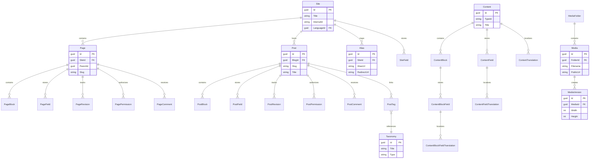

# Data Architecture & Persistence Layer

Piranha.Core uses Entity Framework Core as its primary persistence mechanism and models a fairly rich CMS schema around pages, posts, content blocks, taxonomies, media, sites, and comments. The data layer is designed to be portable across SQLite, SQL Server, PostgreSQL, and MySQL, with caching and storage abstracted behind interfaces in the core runtime.

## Database Configuration

| Service/Module | DB Type | Profile | Driver | Connection | Migration Tool |
|---|---|---|---|---|---|
| `Piranha.Data.EF.SQLite` | SQLite | Example host default | `Microsoft.EntityFrameworkCore.Sqlite` | File-based connection string such as `Filename=./piranha.db` | EF Core migrations and runtime initialization |
| `Piranha.Data.EF.SQLServer` | SQL Server | Provider-specific package | `Microsoft.EntityFrameworkCore.SqlServer` | Host-supplied connection string | EF Core migrations and runtime initialization |
| `Piranha.Data.EF.PostgreSql` | PostgreSQL | Provider-specific package | `Npgsql.EntityFrameworkCore.PostgreSQL` | Host-supplied connection string | EF Core migrations and runtime initialization |
| `Piranha.Data.EF.MySql` | MySQL | Provider-specific package | `Pomelo.EntityFrameworkCore.MySql` | Host-supplied connection string | EF Core migrations and runtime initialization |
| Identity provider projects | Matches selected provider | Provider-specific | Identity EF Core plus matching provider | Host-supplied connection string | EF Core design package and runtime initialization |

## Data Ownership per Service

| Service | Tables Owned | ORM Framework | Caching | Notes |
|---|---|---|---|---|
| Core content runtime | `Content`, `ContentBlock`, `ContentField`, translations, types, groups | EF Core | Memory or distributed cache via `ICache` | Owns dynamic content schema and shared content records |
| Page management | `Page`, `PageBlock`, `PageField`, `PageRevision`, `PagePermission`, `PageComment`, `PageType` | EF Core | Inherited from core cache layer | Handles hierarchy, revisions, permissions, and comments |
| Post management | `Post`, `PostBlock`, `PostField`, `PostRevision`, `PostPermission`, `PostComment`, `PostTag`, `PostType` | EF Core | Inherited from core cache layer | Handles archive content, tags, categories, and revisions |
| Site and taxonomy management | `Site`, `SiteField`, `SiteType`, `Language`, `Alias`, `Taxonomy`, `Category`, `Tag`, `Param` | EF Core | Inherited from core cache layer | Supports multi-site, routing, language, and configuration data |
| Media management | `Media`, `MediaFolder`, `MediaVersion` | EF Core plus storage adapters | Inherited from core cache layer | Blob and file storage hold the binary payloads outside the relational store |

## Entity Model

## Key Repository Methods

| Service | Repository | Notable Methods | Purpose |
|---|---|---|---|
| Pages | `IPageRepository` / `PageRepository` | Page hierarchy and revision retrieval methods | Load and persist pages, revisions, permissions, and sitemap structure |
| Posts | `IPostRepository` / `PostRepository` | Archive-aware lookup methods and taxonomy joins | Manage blog posts, categories, tags, and revisions |
| Media | `IMediaRepository` / `MediaRepository` | Folder-scoped listing and version-aware media access | Persist media metadata while storage adapters handle binaries |
| Content | `IContentRepository` / `ContentRepository` | Generic content and translation queries | Support shared content items and localized content fields |
| Sites | `ISiteRepository` / `SiteRepository` | Site retrieval and default site lookups | Manage multisite boundaries and site metadata |
| Aliases and taxonomies | `IAliasRepository`, taxonomy-related repositories | Site-scoped routing and taxonomy lookups | Resolve redirects, categories, and tags |

## Caching Strategy

Piranha exposes an `ICache` abstraction with memory-cache and distributed-cache implementations. The runtime supports cache levels from minimal to full, allowing hosts to cache sites and params only or extend caching to content types and broader CMS data; the primary pattern is cache-aside, with services reading from cache before repository access and invalidating cache entries when content changes.

## Data Ownership Boundaries

The solution uses a shared relational store per deployed CMS instance rather than isolated databases per internal module. Cross-module access occurs through the shared `DbContext` and repository contracts inside the same process, not through external service calls, so page, post, media, taxonomy, and site workflows all operate over a common schema while still keeping ownership boundaries in separate repositories and services.

### Data Classification & Sensitivity

| Entity | Sensitive Fields | Classification | Controls in Place |
|---|---|---|---|
| `Site` | Hostnames, descriptive metadata | None | Standard application access controls only |
| `PageComment` and `PostComment` | Author, email, URL, IP address, user agent | PII | Manager moderation and authorization flows; no explicit encryption or masking found in source |
| `Media` | Title, alt text, description, public URL | None | Standard application access controls only |
| Identity user entities | User account data managed by ASP.NET Core Identity | PII | Relies on ASP.NET Core Identity integration; no field-level masking found in this repository |
| Page and post content | Author-created content and metadata | None | Standard application access controls only |
