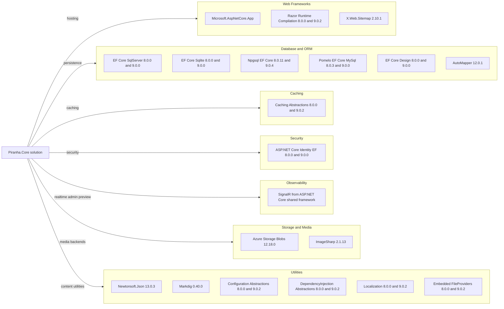

# Dependency Map

Piranha.Core is a multi-project .NET solution with direct dependencies concentrated around ASP.NET Core hosting, Entity Framework Core providers, identity, storage, and content utilities. The build files expose about 18 notable production dependency families across the core, data, and identity projects.

## Dependencies

### Dependency Summary

| Category | Count | Key Libraries | Notes |
|---|---:|---|---|
| Web Frameworks | 3 | Microsoft.AspNetCore.App, Razor Runtime Compilation, X.Web.Sitemap | Shared framework plus package-based CMS hosting helpers |
| Database / ORM | 6 | EF Core provider packages, AutoMapper | Multi-database strategy across SQL Server, SQLite, PostgreSQL, and MySQL |
| Caching | 1 | Microsoft.Extensions.Caching.Abstractions | Cache abstraction with memory and distributed implementations in source |
| Security | 1 | Microsoft.AspNetCore.Identity.EntityFrameworkCore | Used by the provider-specific identity projects |
| Observability | 1 | ASP.NET Core SignalR | Used for manager preview updates rather than metrics export |
| Storage / Media | 2 | Azure.Storage.Blobs, SixLabors.ImageSharp | Handles cloud storage and image transformations |
| Utilities | 6 | Newtonsoft.Json, Markdig, configuration and DI abstractions, localization, embedded files | Supports content serialization, markdown rendering, and packaging |

### Version & Compatibility Risks

The solution multi-targets `net8.0` and `net9.0`, so most packages are declared in paired 8.x and 9.x versions. The most visible compatibility risk is `AutoMapper 12.0.1`, which already triggers a `NU1903` advisory during baseline builds; the upgrade assessment should also review how the EF Core provider packages and ASP.NET Core Identity packages align with a future `net10.0` target.

### Notable Observations

- The solution deliberately duplicates EF Core and Identity provider dependencies across four database-specific packages rather than centralizing on a single provider.
- Most web hosting capability comes from the shared `Microsoft.AspNetCore.App` framework reference, so the package graph is smaller than the overall feature set implies.
- Media support is intentionally split between local storage and Azure Blob Storage packages, which keeps the core package free of cloud-specific dependencies.
- The build files show no dedicated observability or telemetry package; realtime preview uses SignalR from the shared framework instead.

## Test Dependencies

| Framework | Version | Notes |
|---|---:|---|
| Microsoft.NET.Test.Sdk | 17.9.0 | Present in both test projects |
| xUnit | 2.7.0 | Primary test framework for core and manager tests |
| xUnit runner Visual Studio | 2.5.7 | IDE and CLI runner integration |
| coverlet.collector | 6.0.2 | Coverage collection |
| coverlet.msbuild | 6.0.2 | MSBuild-based coverage output |

Total test-scope dependencies: 5

The test infrastructure is conventional and lightweight, relying on xUnit plus Coverlet for coverage. No separate integration-test container framework or contract-testing library is declared in the build files.
